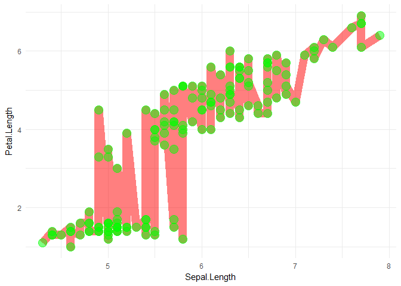
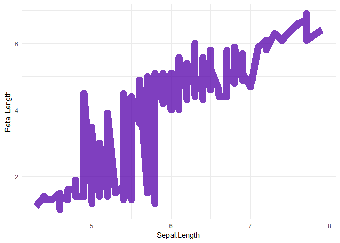

<!-- README.md is generated from README.Rmd. Please edit that file -->
geomclone
=========

Example
-------

``` r
library(ggplot2)

a <- ggplot(iris, aes(Sepal.Length, Petal.Length)) +
  geom_line(colour = alpha("red", 0.5), size = 5) +
  theme_minimal()

a
```



``` r
library(geomclone)

a + geom_clone(colour = alpha("blue", 0.5))
```


