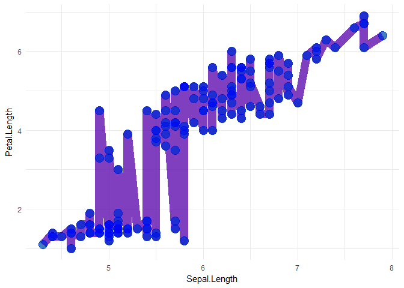

<!-- README.md is generated from README.Rmd. Please edit that file -->
geomclone
=========

This is a test package for cloning ggplot2 Layers using "ggplot2\_add" (<https://github.com/tidyverse/ggplot2/pull/2309>).

Example
-------

``` r
library(ggplot2)

p <- ggplot(iris, aes(Sepal.Length, Petal.Length)) +
  geom_line(colour = alpha("red", 0.5), size = 5) +
  geom_point(colour = alpha("green", 0.5), size = 5) +
  theme_minimal()

p
```


``` r
library(geomclone)

p + geom_clone(colour = alpha("blue", 0.5))
```


